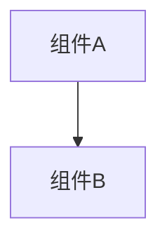

# 架构设计

## 总体架构


## 技术栈
- **后端:** [语言/框架]
- **前端:** [框架/库]
- **数据:** [数据库/存储]

## 核心流程
```mermaid
sequenceDiagram
    Participant->>System: Action
```

## 重大架构决策
完整的 ADR 存储在各变更的 how.md 中，本章节提供索引。

| adr_id | title | date | status | affected_modules | details |
|--------|-------|------|--------|------------------|---------|
| ADR-[编号] | [标题] | YYYY-MM-DD | ✅已采纳/❌已废弃 | [模块列表] | [链接] |

